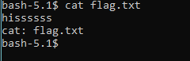
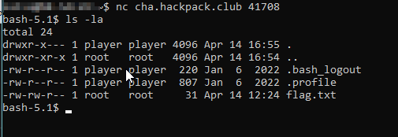
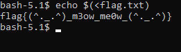
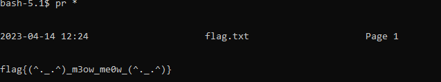

# **Writeup - HackPackCTF**

* Category **Misc** 
* Name **Cat Me if You Can** 
* Difficulty **Easy**

## Description

>There's a flag hiding in plain sight, Our cat has been trying to get it for a while now, but it keeps escaping him at the last moment. Can you help him out? Author: Chika
>nc cha.hackpack.club 41708 

## **Solution**

As soon as we connect to the service we can see that we are provided with a reverse shell:

let's look at what's in the start folder

by running the command `ls -la` we check the files inside the folder and discover the presence of only one file called "flag.txt"

if we try to read the file using `cat` we will find that our reverse shell has limitations, in fact we will be answered "hisssss"

>for this challenge I found two solutions (there would be millions of them)

### **First solution (command substitution)**

the goal is simple:
run `>flag.txt` in a subshell and pass the result to `echo`.

This allows us to bypass the filter and read the flag,
we will use `$()` to do this.

brief explanation of the command:

>The command contained in `$()` or between the backticks \`..\` is executed in a subshell and the output is then inserted into the original command.

`echo $(<flag.txt)`

### **Second solution (pr command)**

the goal is simple:

print yourself all the files in the folder 

brief explanation of the command:

>pr - convert text files for printing

`pr *`

flag: ***flag{(^._.^)_m3ow_me0w_(^._.^)}***
