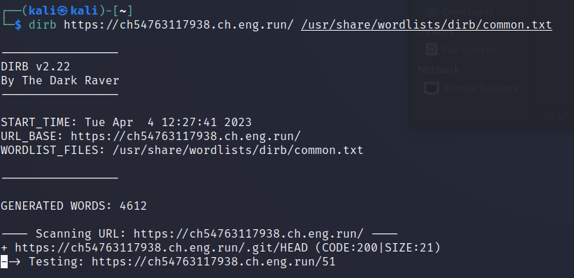

# **Writeup - VishwaCTF**

* Category **WEB** <!-- challenge category -->
* Name **Mascot** <!-- challenge name -->
* Difficulty **Medium**

## Description
The challenge show us a site, and the description talks about a very gracious host. 

## **Solution**
Now it is possible to observe that the only purpose of the page is to allow users to play criss-cross game. There weren't no hints from the page so we tried to recover information with gospider but no sitemap was available. So we tried using dirb from kali command line and using the command:
```sh
dirb https://ch54763117938.ch.eng.run/ /usr/share/wordlists/dirb/common.txt 
```
The first directory founded by dirb is .git directory, as shown in the image:  In this folder we can retrieve information about a precise repository. Indeed, we found inside the config file the reference to a github repository. In the linked repository in config file we can found a file named "FLAGGGGG.md" in which is saved the flag **VishwaCTF{0ctOc@t_Ma5c0t}**
